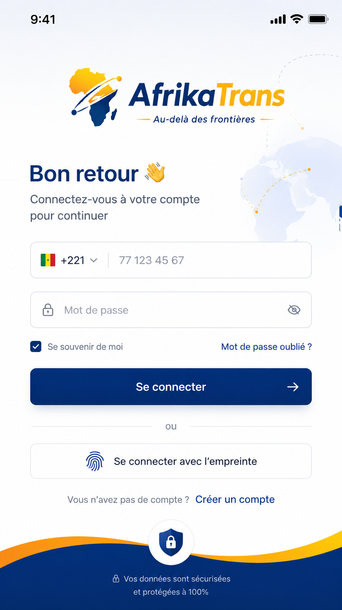

<p align="center">
  
</p>

<h1 align="center">AfrikaTrans Mobile</h1>

<p align="center">
  Transfert d’argent interafricain — application iOS &amp; Android<br />
  <strong>React Native CLI</strong> · TypeScript · React Navigation
</p>

<p align="center">
  
  &nbsp;
  
  &nbsp;
  
</p>

---

## À propos

AfrikaTrans connecte les utilisateurs aux opérateurs mobile money africains (Wave, Orange Money, MTN MoMo, Moov Money) pour envoyer de l’argent de façon claire, sécurisée et traçable.

Ce dépôt est **uniquement** l’app mobile. Les autres produits vivent dans des repos séparés :

| Dépôt | Rôle |
| --- | --- |
| `afrikatrans_mobile` | App iOS / Android (ce repo) |
| `afrikatrans-web` | Site client |
| `afrikatrans-admin` | Back-office |
| `afrikatrans-api` | API NestJS |

Le backend n’est pas encore branché en prod : l’app tourne déjà en **mode mock** (`USE_MOCKS`), avec des contrats alignés sur `/api/v1`.

---

## Identité visuelle

### Logos marque

| Light | Dark |
| :---: | :---: |
|  |  |

Marque UI exclusivement via `BrandLogo` (`logo_light` / `logo_dark`). Ne pas utiliser `app-icon.png` dans l’app.

### Opérateurs

| Wave | Orange Money | MTN MoMo | Moov Money |
| :---: | :---: | :---: | :---: |
|  |  |  |  |

### Fonds & ambiance

<p align="center">
  
  &nbsp;
  
  &nbsp;
  
</p>

Catalogue détaillé et conventions d’import : [`src/assets/README.md`](src/assets/README.md).

Importer via le catalogue central :

```ts
import { logos, operatorLogos, splash, backgrounds, lottieAssets } from '@/assets';
// ou : from '../assets' / 'src/assets' selon votre alias
```

```text
src/assets/
├── logos/            # Marque + opérateurs
├── splash/           # Splash light / dark
├── backgrounds/      # Onboarding & auth
├── auth/             # Preview connexion
├── lottie/           # network-orbit, secure-pulse, transfer-flow
└── reference/admin/  # Visuels référence (hors UI mobile)
```

---

## Stack

```text
React Native 0.86  ·  React 19  ·  TypeScript (strict)
React Navigation   ·  TanStack Query  ·  Zustand
React Hook Form    ·  Zod  ·  Lucide  ·  Lottie
Keychain / Keystore (tokens sensibles)
```

**Interdit :** Expo, Expo Router.

---

## Prérequis

- Node.js ≥ **22.11**
- Xcode (iOS) + CocoaPods
- Android Studio / SDK (Android)
- [Guide environnement React Native](https://reactnative.dev/docs/set-up-your-environment)

---

## Installation

```bash
git clone git@asg:Asguiro/afrikatrans_mobile.git
cd afrikatrans_mobile
npm install
```

> L’host SSH **`asg`** pointe vers GitHub avec la clé personnelle (`~/.ssh/config`).  
> Équivalent classique : `git@github.com:Asguiro/afrikatrans_mobile.git`.

### iOS

```bash
npm run ios:pods   # pod install (+ fallback lottie-ios si CDN indisponible)
npm run ios
```

### Android

```bash
npm run android
```

### Android — APK / AAB release (production)

Prérequis locaux (jamais committer) :

1. Keystore : `android/app/afrikatrans-upload.keystore`
2. Credentials : `android/keystore.properties` (modèle : `android/keystore.properties.example`)

```bash
# APK installable (sideload / stores hors Play)
npm run android:release

# AAB pour Google Play
npm run android:bundle
```

Sorties :

| Artefact | Chemin |
| --- | --- |
| APK release | `android/app/build/outputs/apk/release/AfrikaTrans-<version>-release.apk` |
| AAB release | `android/app/build/outputs/bundle/release/app-release.aab` |

Signature alignée sur la [doc React Native — Signed APK](https://reactnative.dev/docs/signed-apk-android). Conservez le keystore et les mots de passe hors Git (backup chiffré recommandé).

### Metro

```bash
npm start
```

### Tests & lint

```bash
npm test
npm run lint
```

---

## Configuration

Fichier : [`src/config/env.ts`](src/config/env.ts)

| Clé | Rôle |
| --- | --- |
| `USE_MOCKS` | `true` = fixturés locaux (défaut tant que l’API n’est pas dispo) |
| `API_BASE_URL` | Base `/api/v1` quand le backend est prêt |
| `QUOTE_TTL_MS` | TTL client des devis (indicatif) |
| `MOCK_LATENCY_MS` | Latence simulée |

Aucune secret dans le code. Tokens uniquement en Keychain / Keystore.

---

## Structure

```text
src/
├── assets/           # Logos, splash, fonds, Lottie
├── components/       # ui · brand · feedback · navigation
├── features/         # auth · transfer · home · activity · kyc · …
├── navigation/       # Root, Auth, App tabs, Transfer, KYC
├── services/         # api (http + contrats) · mocks · secureStorage
├── stores/           # session · transferDraft · preferences
├── hooks/            # TanStack Query + bootstrap session
├── theme/            # tokens + ThemeProvider
├── schemas/          # Zod
├── types/            # contrats API
└── utils/
```

### Navigation (vue d’ensemble)

```text
Root
├── Splash / Onboarding
├── Auth (welcome → OTP → PIN → login…)
├── KYC
└── App
    ├── Accueil
    ├── Activité
    ├── Bénéficiaires
    ├── Support
    └── Profil
         └── Transfer (stack modal / dédié)
```

Les montants, frais, taux, limites et statuts viennent du **backend** (ou mocks réalistes). L’UI ne hardcode pas de règles métier définitives.

---

## Scripts npm

| Script | Description |
| --- | --- |
| `npm start` | Metro |
| `npm run ios` | Build + run iOS |
| `npm run android` | Build + run Android (debug) |
| `npm run android:release` | APK release signé |
| `npm run android:bundle` | AAB release (Play Store) |
| `npm run ios:pods` | CocoaPods (+ lottie-ios local si besoin) |
| `npm test` | Jest |
| `npm run lint` | ESLint |

---

## Remote Git (compte personnel)

SSH déjà configuré côté machine :

```sshconfig
Host asg
  HostName github.com
  User git
  IdentityFile ~/.ssh/id_ed25519
  IdentitiesOnly yes
```

Dans ce dépôt :

```bash
git remote add origin git@asg:Asguiro/afrikatrans_mobile.git
# ou, si origin existe déjà :
git remote set-url origin git@asg:Asguiro/afrikatrans_mobile.git

ssh -T git@asg
git push -u origin main
```

---

## Documentation

| Doc | Contenu |
| --- | --- |
| [`docs/README.md`](docs/README.md) | Index packs docs / Cursor |
| [`docs/architecture/MOBILE-ARCHITECTURE.md`](docs/architecture/MOBILE-ARCHITECTURE.md) | Architecture mobile |
| [`docs/afrikatrans-phase-2-design/02-MOBILE-DESIGN.md`](docs/afrikatrans-phase-2-design/02-MOBILE-DESIGN.md) | Design mobile |
| [`src/assets/README.md`](src/assets/README.md) | Assets & Lottie iOS |

Les dossiers `docs/` (vision, specs, Prisma, Nest, etc.) sont **lecture seule** pour le contexte produit : le code applicatif vit dans `src/`, `android/`, `ios/`.

---

## Sécurité (rappel mobile)

- Pas de token en AsyncStorage
- Keychain (iOS) / Keystore (Android)
- Biométrie locale uniquement
- Jamais logger mot de passe, PIN, OTP, token ou documents KYC

---

## Licence

Propriétaire — AfrikaTrans / Derlick. Tous droits réservés.
